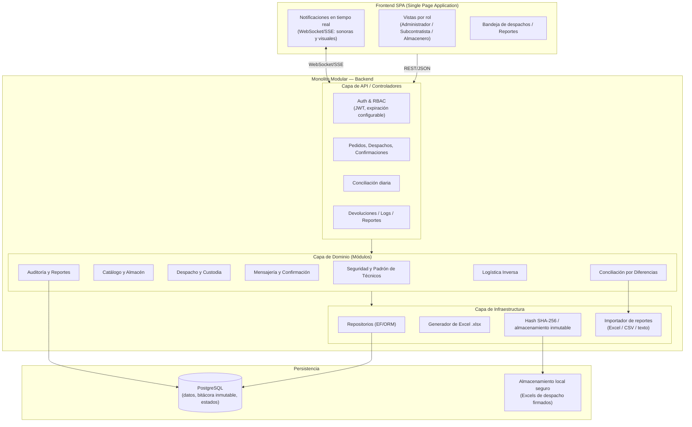

# Arquitectura del Sistema

Monolito modular en capas con frontend SPA y base de datos PostgreSQL.

## Notas

- El frontend es una SPA desacoplada que consume la API REST del monolito.
- El backend es un único despliegue con módulos de dominio separados.
- PostgreSQL es la única base de datos; los Excels firmados se guardan en disco.
- Las notificaciones en tiempo real usan canal push (WebSocket/SSE) entre Almacenero y Subcontratista.
