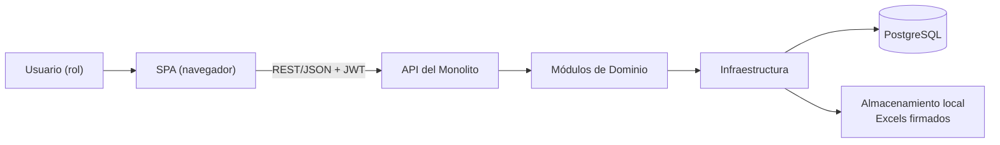

# Funcionamiento de la Arquitectura

Este documento explica cómo opera la arquitectura definida en `arquitectura2.md`: **Monolito modular en capas + SPA + PostgreSQL**.

## Visión general

El sistema es una aplicación web única (monolito) cuyo backend está organizado en capas y módulos de dominio. El frontend es una SPA desacoplada que consume la API. PostgreSQL es la única base de datos relacional y los archivos Excel se guardan en disco con firma SHA-256.

## 1. Frontend SPA

- Es una aplicación de una sola página (React/Angular/Vue, por definir) que contiene las vistas por rol: Administrador, Subcontratista y Almacenero.
- Consume la API del backend vía HTTP REST con JSON y adjunta el token JWT en cada petición.
- Mantiene una conexión persistente (WebSocket o SSE) para recibir notificaciones en tiempo real: sonoras y visuales cuando llega un despacho a la bandeja del Almacenero.
- No contiene lógica de negocio crítica; la validación real siempre ocurre en el backend.

## 2. Backend: Monolito en capas

Aunque es un solo despliegue, el código se separa en capas con dependencias unidireccionales:

### Capa de API / Controladores

- Recibe las peticiones HTTP, valida el JWT y verifica el rol del usuario (RBAC).
- Mapea las rutas hacia los servicios de dominio correspondientes.
- Ejemplos: endpoints de autenticación, de creación de despacho, de confirmación de entrega, de importación de reportes, de reportes mensuales.

### Capa de Dominio (módulos)

El corazón del sistema, dividido en módulos según los procesos de negocio:

| Módulo | Responsabilidad |
|---|---|
| Seguridad y Padrón de Técnicos | Usuarios, roles, técnicos, estados operativos |
| Catálogo y Almacén | Materiales serializados/no serializados, ingresos, existencias |
| Despacho y Custodia | Creación de despachos, cupos de técnicos, generación de Excel |
| Mensajería y Confirmación | Bandeja en tiempo real, confirmación/rechazo de entregas |
| Conciliación por Diferencias | Comparación de series, consumo de fungibles, alertas |
| Logística Inversa | Devoluciones, equipos recuperados/bajas, actas a contrata |
| Auditoría y Reportes | Bitácora inmutable, cortes mensuales, exportación |

Cada módulo encapsula sus reglas de negocio y expone una interfaz clara, de modo que los cambios en un flujo afectan mínimamente a los demás.

### Capa de Infraestructura

- **Repositorios**: acceso a datos mediante un ORM/Entity Framework, aislado tras interfaces.
- **Generador de Excel**: produce el formato `.xlsx` estandarizado de despacho.
- **Servicio de integridad**: calcula y verifica el hash SHA-256 de cada documento.
- **Importador de reportes**: procesa archivos Excel/CSV/texto del reporte diario de la contrata.

## 3. Persistencia

### PostgreSQL

- Almacena: usuarios, técnicos, catálogo, stock con separación disponible/comprometido, despachos, estados de equipos, bitácora de auditoría y resultados de conciliación.
- Las operaciones críticas (confirmar entrega, mover stock) se ejecutan como transacciones ACID.
- La bitácora es append-only: no se permiten borrados ni modificaciones de registros históricos.

### Almacenamiento local seguro

- Cada Excel de despacho se guarda como archivo inmutable.
- Su hash SHA-256 se registra en PostgreSQL; al consultar, se recalcula y compara para detectar alteraciones.

## 4. Flujos principales

### Despacho de material

1. El Subcontratista crea la orden en la SPA.
2. La API valida el JWT y el rol, y el módulo de Despacho verifica stock y cupo del técnico.
3. Se genera el Excel `.xlsx`, se calcula su SHA-256 y se guarda en disco + BD.
4. Se notifica al Almacenero en tiempo real por WebSocket/SSE.

### Confirmación de entrega

1. El Almacenero revisa el Excel, previsualiza y descarga.
2. Confirma o rechaza (con motivo) la entrega.
3. La acción de confirmar ejecuta una transacción: actualiza estado del despacho y stock.
4. El Subcontratista recibe la notificación.

### Conciliación diaria

1. El Subcontratista carga el reporte de la contrata (Excel/CSV/texto).
2. El importador lo parsea y el módulo de Conciliación compara series del sistema vs. reporte.
3. Las series ausentes pasan a estado *instalado*; se calcula el consumo de fungibles.
4. Se generan alertas de discrepancias y se imputan a la producción del día.

### Auditoría

1. Cada movimiento (entrada, salida, reingreso, merma) escribe un registro en la bitácora con usuario, fecha, hora y saldos previo/posterior.
2. El reporte mensual totaliza solicitado/recibido, asignado, liquidado y % no justificado.
3. Se exporta a Excel para la contrata principal.

## 5. Por qué esta arquitectura

- **Monolito**: el dominio es único y cohesivo; evita la complejidad operacional de microservicios.
- **Modularidad en capas**: permite reemplazar infraestructura (ORM, motor de Excel, notificaciones) sin tocar reglas de negocio.
- **SPA desacoplada**: la interfaz puede evolucionar o desplegarse de forma independiente del backend.
- **PostgreSQL + archivos firmados**: equilibrio entre consistencia transaccional y verificabilidad documental exigida por el contrato con la contrata principal.
